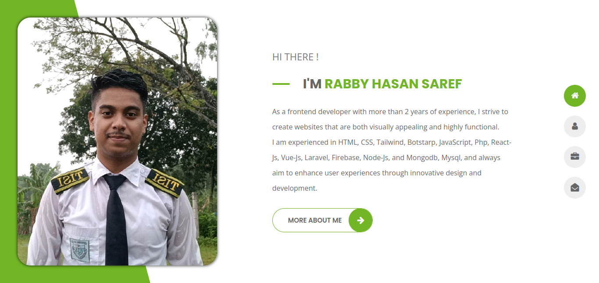

# Personal-Portfolio

A responsive and modern personal portfolio website built with HTML, CSS, JavaScript, and PHP. This project showcases skills, projects, and experiences with interactive features and dynamic contact form integration.

## Key Features

- **Responsive Design**: Optimized for desktops, tablets, and mobile devices.
- **Portfolio Showcase**: Organized sections to highlight projects and achievements.
- **Interactive Features**: Smooth animations and dynamic JavaScript functionalities.
- **Contact Form**: PHP-powered form for sending inquiries directly to email.
- **Customizable**: Easily update content and add new projects.

Feel free to use and adapt this template for your own portfolio!

## Usage

1. Clone the repository.
   ```bash
   git clone https://github.com/RabbyHasanSaref/Personal-Portfolio.git
   ```
2. Update content in the HTML and PHP files to reflect your personal information.
3. Deploy it on your preferred hosting platform.

## Technologies Used

- **HTML5** for structure
- **CSS3** for styling and responsiveness
- **JavaScript** for interactivity
- **PHP** for backend form handling

## Preview

Add a live link or screenshot if available.
Live Link: [Personal Portfolio](https://rabby-hasan-saref.netlify.app/)
